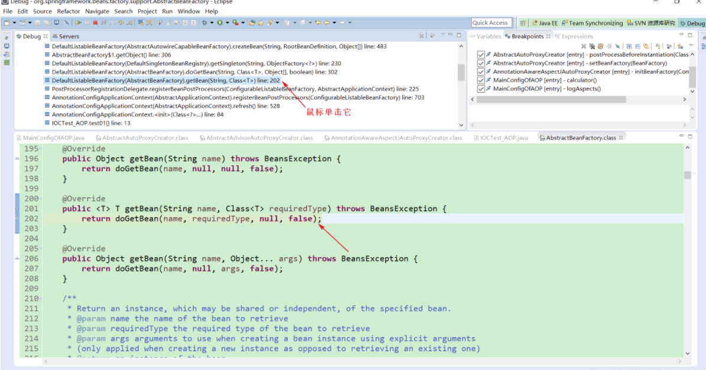
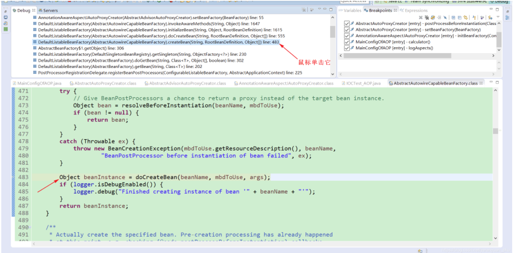

#       Spring 注解驱动 ADD


# 第一章 容器 

## 1.1组件注册

### 注解开发

> 导入spring所需依赖

> spring原生xml bean注册


> 使用配置类 代替xml

MainConfig

```java
@Configuration //配置类
public class MainConfig {

//
//    @Bean(可以指定容器id)
    @Bean //给容器注册一个bean; 类型为返回值的类型 id 为默认方法名
    public Magic magic(){
        return new Magic("Reines",100);
    }

}
```

Magic

```java
public class Magic {

    private String name;

    private int level;

    public Magic(String name, int level) {
        this.name = name;
        this.level = level;
    }


    public void setName(String name) {
        this.name = name;
    }

    public void setLevel(int level) {
        this.level = level;
    }
    public String getName() {
        return name;
    }

    public int getLevel() {
        return level;
    }

    @Override
    public String toString() {
        return "Magic{" +
                "name='" + name + '\'' +
                ", level=" + level +
                '}';
    }
}
```

> 替代测试
>
> ```java
> @Test
> void contextLoads() {
> 
>     AnnotationConfigApplicationContext applicationContext = new AnnotationConfigApplicationContext(MainConfig.class);
>     Magic magic = applicationContext.getBean(Magic.class);
>     System.out.println(magic);
> }
> ```

结果：

~~~java
Magic{name='Reines', level=100}
~~~


#### (1)@Bean

- 概念：在容器中配置一个 bean 实例
- 使用
  - 类型为返回值类型，id 默认为方法名
  - 可以指定**注解的 value 值** 为对应的 id
- 标注的方法中使用的参数都会从 IOC 容器中获取

#### (2)@Configuration

- 概念：告诉spring 这是一个配置类

#### (3)@ComponentScan

- 概念：扫描规则 开启组件扫描

- 使用

  - **value**: 扫描 指定包下

    > ```
    > value = "com.geek"
    > ```

  - **includeFilters**： 指定扫描的时候只包含哪些组件

    - @Filter 配置过滤的条件

      - type：过滤规则，值为 FilterType 枚举类实例

        | ANNOTATION      | 根据注解来排除                                               |
        | --------------- | ------------------------------------------------------------ |
        | ASSIGNABLE_TYPE | 根据类类型来排除                                             |
        | ASPECTJ         | 根据AspectJ表达式来排除                                      |
        | REGEX           | 根据正则表达式来排除                                         |
        | CUSTOM          | 自定义FilterClass排除，需要实现`org.springframework.core.type.filter.TypeFilter`接口 |

      - classes：对应的实例类型

    > ```
    > @Filter(type = FilterType.ANNOTATION,classes = {Controller.class, Service.class})//排除或包含带有controller 和service 注解的类
    > ```

  -  **excludeFilters** ：指定扫描的时候排除哪些组件
  
- @Filter 配置过滤的条件 与**includeFilters**条件配置相同
  
-  useDefaultFilters： 默认自动扫描规则
  
  默认为全部扫描 开启为true
  
    ```
    useDefaultFilters = false
    ```

> ##### 扩展

**自定义TypeFilter指定过滤规则**

创建MyTypeFilter 实现TypeFilter 接口

```java
/**
 * @Author Robert
 * @create 2021/5/13 11:00
 * @Version 1.0
 * @Description: 自定义Filter 规则
 */
public class MyTypeFilter implements TypeFilter {
//    实现的match方法 返回一个boolean 值
    /*
     * @param metadataReader the metadata reader for the target class
     * MetadataReader 读取到的当前正在扫描的类的扫描信息
     *
     * @param metadataReaderFactory a factory for obtaining metadata readers
     * for other classes (such as superclasses and interfaces)
     * MetadataReaderFactory 可以获取到其他任何类的信息
     */

    @Override
    public boolean match(MetadataReader metadataReader, MetadataReaderFactory metadataReaderFactory) throws IOException {
        //获取当前类注解信息
        AnnotationMetadata annotationMetadata = metadataReader.getAnnotationMetadata();
        //获取当前正在扫描的类的信息
        ClassMetadata classMetadata = metadataReader.getClassMetadata();
        //获取到当前扫描类的类名
        String className = classMetadata.getClassName();
        System.out.println("--->"+className);
        //获取当前类资源信息（类的路径）
        Resource resource = metadataReader.getResource();
        //如果包含类名包含er 就扫描进去
        if (className.contains("er")) return true;
        return false;
    }
}
```

使用：

```
@Filter(type = FilterType.CUSTOM,classes = {MyTypeFilter.class})//指定自定义Filter规则
public class MainConfig {
...
}
```

> @Filter  (type = FilterType.CUSTOM 中指定自定义注解类 class = {MyTypeFilter.class}

#### (4)@Scope

- 概念：设置组件（bean）作用域

- 参数 可设置 默认为（单实例）

  -  prototype 多实例
  -  singleton 单实例 （默认）

  - request(不常用)：在同一次请求内创建一次
  - session(不常用)：在同一次会话内创建一次

- 测试 （多实例）

> ```java
> @Configuration //配置类
> public class MainConfig2 {
> 
> 
>     /*@Scope：调整作用域
>      *
>      * @see ConfigurableBeanFactory#SCOPE_PROTOTYPE
>      * @see ConfigurableBeanFactory#SCOPE_SINGLETON
>      * @see org.springframework.web.context.WebApplicationContext#SCOPE_REQUEST
>      * @see org.springframework.web.context.WebApplicationContext#SCOPE_SESSION
>      * @return
>      *
>      * SCOPE_PROTOTYPE 多实例 多实例情况下 ioc容器启动时不会去调用方法创建对象放在容器中
>      *                      而是每次获取时才会调用方法 创建对象
>      * SCOPE_SINGLETON 单实例（默认） ioc容器启动时会调用方法创建对象放到ioc容器中
>      *                      获取时直接从容器（map.get()）中拿
>      * SCOPE_REQUEST 同一次请求创建一次实例
>      * SCOPE_SESSION 同一次session 创建一次实例
>      */
>     @Scope("prototype")//设置多实例 作用域
>     @Bean("Magic")//设置bean id
>     public Magic magic(){
>         return new Magic("shine",777);
>     }
> 
> }
> 
> @Test
> void testScope(){
>     AnnotationConfigApplicationContext applicationContext = new AnnotationConfigApplicationContext(MainConfig2.class);
> 
>     System.out.println("已创建ioc容器");
>     //多实例情况下测试 bean所调用的方法
>     Object magic1 = applicationContext.getBean("Magic");
>     Object magic2 = applicationContext.getBean("Magic");
>     System.out.println(magic1 == magic2); //false	
> 
> }
> ```

#### (5)@Lazy

- 概念：懒加载 

  ​	懒加载 - 针对于单实例使用，在第一次获取 bean 实例时创建对应的 bean 实例

#### (6)@Conditional

- 概念：按照一定条件进行判断，满足条件给容器注册bean

- 使用：

  - ```java
    Class<? extends Condition>[] value();
    ```

  参数为类名

- 测试：

  - 编写条件condition类实现condition接口

    ```java
    //实现条件Condition 接口
    public class LinuxCondition implements Condition {
        /**
     * ConditionContext：判断条件能使用的上下文（环境）
     * AnnotatedTypeMetadata：注释的信息
     * @param context
     * @param metadata
     * @return
     */
        @Override
        public boolean matches(ConditionContext context, AnnotatedTypeMetadata metadata) {
            //判断环境是否为linux系统
            //  context上下文
            //1.可以获取到当前ioc容器的beanFactory工厂
            ConfigurableListableBeanFactory beanFactory = context.getBeanFactory();
            //2.获取当前类加载器
            ClassLoader classLoader = context.getClassLoader();
            //3.获取当前系统环境信息
            Environment environment = context.getEnvironment();
            //4.获取到bean定义的注册类
            BeanDefinitionRegistry registry = context.getRegistry();
    
            //获取系统信息
            String property = environment.getProperty("os.name");
    
            //判断容器是否包含某个bean
            boolean definition = registry.containsBeanDefinition("Magic");
            //property中不包含window就可以通过
            if(!property.contains("Windows")) {
                return true;
            }
            return false;
        }
    }
    ```

  -  @Conditional(WindowsCondition.class)//满足当前条件这个类才生效

    注解添加到类或方法上

#### (7)@Import

- 概念：快速导入组件到容器

- 使用：

  - 三种方式
    - (1).@Import(要导入到容器的组件)：容器自动注册这个组件 id默认为组件的全类名
    - (2).ImportSelector:返回需要导入的组件的全类名数组
    - (3).ImportBeanDefinitionRegistrar：手动注册bean到容器

  ```java
  @Import({Planet.class, MyImportSelector.class,MyImportBeanDefinitionRegistrar.class})
  ```

  对应三种方式的导入

  > - MyImportSelector.class 自定义编辑返回需要导入的组件 实现ImportSelect接口
  >
  > ```java
  > /**
  >  * @Author Robert
  >  * @create 2021/5/17 15:59
  >  * @Version 1.0
  >  * @Description: import 导入选择器
  >  */
  > //自定义编辑返回需要导入的组件
  > public class MyImportSelector implements ImportSelector{
  >     //返回值为要返回的组件全类名 数组
  >     //AnnotationMetadata :当前
  >     @Override
  >     public String[] selectImports(AnnotationMetadata importingClassMetadata) {
  >         //importingClassMetadata
  >         //方法不能返回null值
  >         return new String[]{"com.geek.bean.Star"};
  >     }
  > 
  >     @Override
  >     public Predicate<String> getExclusionFilter() {
  >         return null;
  >     }
  > }
  > ```
  >
  > - MyImportBeanDefinitionRegistrar.class 手动注册bean
  >
  > ```java
  > public class MyImportBeanDefinitionRegistrar implements ImportBeanDefinitionRegistrar {
  > 
  > 
  >     /**
  >      * AnnotationMetadata 当前类的注解信息
  >      * BeanDefinitionRegistry bean定义的注册类
  >      *         把所有要添加到容器中的bean，调用 registry.registerBeanDefinition();方法手动注册
  >      * @param importingClassMetadata
  >      * @param registry
  >      */
  >     @Override
  >     public void registerBeanDefinitions(AnnotationMetadata importingClassMetadata, BeanDefinitionRegistry registry) {
  > 
  >         //指定bean定义类型
  >         RootBeanDefinition beanDefinition = new RootBeanDefinition(School.class);
  >         //注册一个bean，指定bean名 手动注册
  >         registry.registerBeanDefinition("school",beanDefinition);
  >     }
  > }
  > ```

### 扩展类

#### 1) AnnotationConfigApplicationContext

- 概念：ApplicationContext 接口的实现类，用于创建配置类的 IOC 容器对象

- 方法

  1. getBean(Class)：传入 Class 类型获取对应的 bean 实例
  2. getBeanNamesForType(Class)：传入 Class 类型获取 IOC 容器中所有对应的 bean 实例的 id
  3. getBeanDefinitionNames()：获取当前 IOC 容器对象中所有 bean 实例的 id
  4. getBeansForType(Class)：可以获取容器中指定类型(Class)的 bean 实例和 id 组成的 Map
  5. getEnvironment()：获取当前容器运行的环境信息对象(Environment)

- 实例

  ```
  // 1. 调用 AnnotationConfigApplicationContext 的构造函数，创建配置类，创建 ApplicationContext 类对象
  ApplicationContext applicationContext = new AnnotationConfigApplicationContext(MainConfig.class);
  
  // 2. 方法调用
  // 2.1 通过 getBean(Class) 传入 Class 类型获取对应的 bean 实例
  Person person = applicationContext.getBean(Person.class);
  // 2.2 通过 getBeanNamesForType(Class) 传入 Class 类型获取 IOC 容器中所有对应的 bean 实例的 id
  String[] names = applicationContext.getBeanNamesForType(Person.class);
  // 2.3 通过 getBeanDefinitionNames() 获取 IOC 容器中所有 bean 实例的 id
  String[] beanDefinitionNames = context.getBeanDefinitionNames();
  // 2.4 getBeansOfType(Class)：可以获取容器中指定类型的 bean 实例和 id 组成的 Map
  Map<String, Person> personMap = context.getBeansOfType(Person.class);
  // 2.5 getEnvironment()：获取当前容器运行的环境信息对象(Environment)
  Environment environment = context.getEnvironment();
  
  // 3. 输出测试
  log.info(person.toString()); // Person(name=巴御前, age=16)
  for (String name : names) {
      System.out.println(name); // person
  }
  ```

#### 2) Environment

- 概念：Spring IOC 容器的运行环境

- 方法：

  1. getProperty("key")：根据 key 获取对应的环境信息

- 实例

  ```
  // getEnvironment()：获取当前容器运行的环境信息对象(Environment)
  Environment environment = context.getEnvironment();
  // environment.getProperty("key")：根据 key 获取对应的环境信息
  String osName = environment.getProperty("os.name"); // os,name -> 运行时的操作系统
  System.out.println(osName); // Windows 10
  ```

#### 3) FactoryBean

- 概念：接口，也是一个 Bean，用户可以通过实现该接口用于定制实例化 Bean 的逻辑

- 使用：

  1. getObject(): FactoryBean 会将该方法的返回结果作为 bean 实例装配到 IOC 容器中
  2. getObjectType(): 获取对应的 bean 实例的类型
  3. isSingleton(): 是否单例，返回 true 则是，反之相反

- 实例：

  1. 实现 FactoryBean 接口

     ```
     /**
      * 通过实现 Factory 用于控制 Person bean 的实例化
      * @author EMTKnight
      * @create 2021-02-26
      */
     public class PersonFactoryBean implements FactoryBean<Person> {
     
         /**
          * 该方法的返回结果会作为 bean 实例装配到 IOC 容器中
          * @return
          * @throws Exception
          */
         @Override
         public Person getObject() throws Exception {
             return new Person("巴御前",17);
         }
     
         @Override
         public Class<?> getObjectType() {
             return Person.class;
         }
     
         @Override
         public boolean isSingleton() {
             return false;
         }
     }
     ```

  2. 使用 @Bean 配置 FactoryBean

  3. 测试

     ```
     @Test
     public void test06(){
         Person person = context.getBean("personFactoryBean", Person.class);
         // 通过注册 FactoryBean 实例时使用的 id 得到的是其通过 getObject() 方法返回的 bean 实例
         System.out.println(person); // Person(name=巴御前, age=17)
         // 如果需要获取的是 FactoryBean 实例，可以在 id 前面加上 &
         Object bean = context.getBean("&personFactoryBean");
         System.out.println(bean); // pers.dreamer07.springAoon.bean.PersonFactoryBean@1532c619
     }
     ```

- 注意：

  1. 通过注册 FactoryBean 的 id 在 IOC 容器中默认获取的是其 getObject() 方法返回后装配的 bean 实例
  2. 如果需要获取 FactoryBean 实例，可以在对应的 id 前加上 **&** 即可

### SpringIOC

- 给 Spring IOC 容器中注册组件的方式
  - 对应自定义的组件：包扫描+组件注解(@Controller/@Service/@Repository/@Component) - id 为对应的类名首字母小写
  - 对应第三方的组件：使用 @Bean 进行注册 - id 为对应的方法名
  - 快速给容器中导入一个 bean：使用 @Import 注解 - id为对应的全类名
  - 使用 Spring 提供的 FactoryBean(工厂 Bean) - id 为对应的方法名

## 1.2 Bean的生命周期

### 一、概念

- bean 的生命周期：创建 -> 初始化 -> 销毁
- 而 Spring 中由 IOC 容器辅助帮我们进行管理
- 我们也可以自定义初始化和销毁方法，容器在bean进行到当前生命周期的时候来调用我们自定义初始化和销毁方法

> **Bean的生命周期**：
>
>  构造（创建对象）
> *      单实例：在容器启动的时候创建对象
> *      多实例；在每次获取的时候才创建对象
>
> 初始化
>
> *      在对象创建后 并赋值完成，调用初始化方法
>
> 销毁
>
> *      单实例：在容器关闭的时候 调用销毁方法
> *      多实例：容器并不会管理这个bean 因为多实例只在获取它时才进行创建，容器不会调用销毁方法 可以手动调用

### 二、自定义bean初始化和销毁方法

#### 1. 通过 @Bean 注解

- 通过@Bean注解 ； （xml内相当于指定  init-method="" destroy-method=""）
- 指定 `@Bean` 注解的 `initNethod` 和 `destroyMethod` 属性为对应的 bean 实例对象中的方法
- 实例：

```Java
/**
 * @Author Robert
 * @create 2021/5/19 10:23
 * @Version 1.0
 * @Description: @bean实现 bean生命周期
 */
public class Real {

    public Real() {
        System.out.println("Real Constructor....");
    }

    public void init(){
        System.out.println("Real init method");
    }
    public void destroy(){
        System.out.println("Real destroy method");
    }
}


    //注入bean   Real
	//@Scope("prototype") 多实例情况下
    @Bean(initMethod = "init",destroyMethod = "destroy")//可以指定 初始化方法 和销毁方法
    public Real real(){
        return new Real();
    }

```

#### 2.Bean类实现InitializingBean&**DisposableBean** 接口

- 可以通过让Bean 实现InitializingBean接口，定义初始化逻辑；实现DisposableBean接口，定义销毁逻辑。
- 实例：

```java
/**
 * @Author Robert
 * @create 2021/5/19 10:49
 * @Version 1.0
 * @Description: 通过 实现InitializingBean  DisposableBean来实现bean的生命周期
 */

@Component
public class Lie implements InitializingBean, DisposableBean {

    public Lie() {
        System.out.println("Lie constructor");
    }

    //实现接口 得到的初始化 方法
    @Override
    public void afterPropertiesSet() throws Exception {
        System.out.println("Lie afterPropertiesSet...");
    }
    //销毁方法
    @Override
    public void destroy() throws Exception {
        System.out.println("Lie destroy...");
    }
}
```

测试：注册到ioc 容器 进行测试

#### 3.Bean类可以使用JSR250规范

- JSR250规范中的两个注解

  - `@PostConstruct` :在bean创建完成并且属性赋值完成；来执行初始化方法

  *      `@PreDestory` : 在容器销毁bean之前 通知我们进行清理工作

- 实例：

```java
/**
 * @Author Robert
 * @create 2021/5/19 11:05
 * @Version 1.0
 * @Description:    第三种方式实现bean 生命周期 两个注解
 */

@Component//将其加入到容器 
public class Voids {


    public Voids() {
        System.out.println("Voids Constructor....");
    }

    //在对象创建 并赋值完成后调用
    @PostConstruct
    public void init(){
        System.out.println("Real @PostConstruct");
    }

    //在容器移除对象之前通知我们
    @PreDestroy
    public void destroy(){
        System.out.println("Real @PreDestroy");
    }

}
```

#### 4.配置类实现BeanPostProcessor接口

- `BeanPostProcessor` [interface]: bean的后置处理器

- 使用 - 重写的两个方法

  1. postProcessBeforeInitialization()：在所有初始化方法之前执行
  2. postProcessAfterInitialization()：在所有初始化方法执行之后执行

- 实例：

  ```java
  /**
   * @Author Robert
   * @create 2021/5/19 14:09
   * @Version 1.0
   * @Description:  后置处理器 初始化前后进行处理
   * 将后置处理器加入到容器中 
   */
  
  @Component
  public class MyBeanPostProcessor implements BeanPostProcessor {
  
      @Override
      public Object postProcessBeforeInitialization(Object bean, String beanName) throws BeansException {
          System.out.println("postProcessBeforeInitialization。。。"+beanName+"->"+bean);
          return bean;
      }
  
      @Override
      public Object postProcessAfterInitialization(Object bean, String beanName) throws BeansException {
          System.out.println("postProcessAfterInitialization。。。"+beanName+"->"+bean);
          return bean;
      }
  }
  ```

#### 5.BeanPostProcessor原理

1. 在 BeanFactory 创建对应的 bean 实例时，会执行 `populateBean()` 方法用于进行属性赋值

   `populateBean`(beanName, mbd, instanceWrapper)

2. 然后执行`initializeBean()` bean实例初始化

3.  `applyBeanPostProcessorsBeforeInitialization(wrappedBean, beanName); `初始化之前调用

    先遍历的得到所有的`getBeanPostProcessors`然后挨个执行`BeforeInitialization`

     一旦返回null，跳出for循环 不会执行后面的`BeanPostProcessors`

4. `invokeInitMethods(beanName, wrappedBean, mbd);` 执行自定义初始化方法

5.  `applyBeanPostProcessorsAfterInitialization(wrappedBean, beanName);`初始化之后执行 与第3步类似

  **扩展：**
*      spring底层对BeanPostProcessor的使用：
*          bean赋值，注入其他组件，@Autowired ,生命周期注解功能，@Async

### bean 生命周期的执行时机

1. 创建：
   - 单实例：在容器启动时创建
   - 多实例：从容器中获取时创建
2. 属性赋值
3. 执行 bean 后置处理器的 postProcessBeforeInitialization()
4. 初始化：在对象创建好之后，并完成赋值之后
5. 执行 bean 后置处理器的 postProcessAfterInitialization()
6. 销毁：容器关闭时


## 1.3 组件赋值

### 注解

#### (1)@Value

- 作用在属性上，在初始化之前完成属性赋值
- 使用@Value注解赋值
  * 1、基本数值
  * 2、使用SpEl表达式：#{}    spring表达式
  * 3、使用${} 取出配置文件的值（在运行环境变量里面的值）

```java
public class Person {
    @Value("咕哒子")
    private String name;

    @Value("#{20-2}")
    private Integer age;

    @Value("${person.nickName}")//取出配置文件的值
    private String nickName;
}
```

#### (2) @PropertySource

- 读取指定配置文件中的内容(k/v)并保存到运行的环境变量中

```java
@PropertySource(value = {"classpath:/person.properties"})//读取外部配置文件 导入类路径 //使用${}取出配置文件的值
@Configuration
public class MainConfigOfPropertyValue {

    @Bean
    public Person person(){
        return new Person();
    }

}


person.nickName=\u8587\u5c14\u8389\u7279
```

- 注意

  1. 保存到环境变量的中，也可以通过 **Environment** 实例对象获取

  2. 和 `@Component` 注解相识，可以通过多个 `@PropertySource` 读取多个配置文件，

     也可以通过使用 `@PropertySources` 中配置多个 `@PropertySource` 读取多个配置文件


## 1.4 组件赋值

### 注解

#### (1) @Autowired

- 自动装配：自动注入容器中对应的 bean 实例 , Spring利用依赖注入（DI）完成对各个组件的依赖关系赋值

- 使用：
  -  (1)、默认按照优先类型去对应的容器中找对应的组件 applicationContext.getBean(BookDao.class);

    ~~~java
    BookService{
        @Autowired
        BookDao bookDao;
    }
    ~~~

  *      (2)、如果找到多个相同类型的组件 再将属性的名称作为属性id 去容器中查找  `applicationContext.getBean(dookDao);`
  *      (3)、使用`@Qualifier("bookDao")`  使用@Qualifier指定需要装配的di，而不是使用属性名
  * (4)、自动装配默认一定要将属性赋值，没有则会报错

    可以使用`@Autowired(required = false)`//装配是否必须 默认为true
  * (5)、可以使用 `@Primary` 指定首选自动装配 让Spring自动装配的时候，默认使用首选的Bean

    也可以继续使用 `@Qualifier` 指定需要转配的bean的名字

#### (2)@Qualifier

- 作用：根据 id 在 IOC 容器中查找对应的 bean 实例

#### (3)@Primary

- 作用：将对应的注册 bean 实例作为 IOC 自动装配时使用的**首选项**

#### (4)@Resource(JSR 250规范)

- 作用：实现自动装配
- 使用
  - 默认通过属性名装配对应的 bean 实例，可以通过指定 name 属性值装配指定的 bean 实例
  - 不支持 `@Qualifier` 和 `@Primary`
  - 无法使用和 `@Autowired(required = false)` 的功能

####  (5)@Inject(JSR 330规范)

- 作用：实现自动装配
- 使用(需要导入javax inject包)
  - 默认通过属性名装配对应的 bean 实例
  - 支持 `@Qualifier` 和 `@Primary`
  - 无法指定任何属性

区别：@Autowired是由spring定义的 而@Resource 和@Inject是java规范

> #### @Autowired & @Resouce & @Inject 的区别

1. @Autowired 在 Spring 中使用的最为广泛，但只能在 Spring 中使用

   而后两者属于 Java 规范，可以在其他的 IOC 框架中使用

2. 强度：@Autowired > @Inject > @Resouce(在 Spring 中的使用)

3. 但三者在 Spring 中都是通过 **AutowiredAnnotationBeanPostProcessor** bean 后置处理器实现自动装配

#### (6)@Autowired 的其他使用功能

- @Aurowired： 可以标在 构造器 方法 参数 属性上;都是从容器中获取参数组件的值

  (1)、标注在方法上； 

  - @bean+方法参数，参数从容器中取获取；默认不写@autowired效果也一致 ，都能够自动装配

  - 注意：如果是 `@Bean` 标注的方法，其中使用的参数都会从 IOC 容器中获取

  (2)、标注在构造器上

  -  如果组件只有一个有参构造器 那么这个有参构造器的@Autowired 可以省略，参数位置的组件还是可以自动从容器中取

  - 注意：
    1. 当类的构造器**有且只有一个构造器**时，无论使不使用 `@Autowired` 都会调用该构造器，其中自定义类型的参数，依然会通过 IOC 中获取
    2. 一个类中**不能有两个/两个以上**由 `@Autowired` 注解**标注的构造器**

  (3)、放在参数位置

  - 效果和放在方法/构造器上一致；但在**构造器**上时，默认还是会调用无参构造器，除非只有当前一个构造器都会从 IOC 容器中获取对应的类型的组件完成赋值

#### (7)@Profile

> *      是spring为我们提供可以根据当前环境，动态的激活和切换一系列组件的功能
> *      指定组件在哪一种环境下才能被注册到环境中，不指定，则任何环境下都能注册这个组件
> *      环境标识 只有环境被激活的时候 才会被激活. 默认为default环境
> *      当写在配置类上时，只有指定环境的时候，整个配置类里面的所有配置才能开始生效
> *      没有profile 标识的bean 则在任何环境都是加载的

- 例如：根据不同的环境(开发环境/测试环境/生产环境)切换数据源

- 使用：

  1. 可以通过指定 value 值为环境标识，来确定组件在对应的环境下才会被注册到容器中

  2. 使用**命令行动态参数**：在虚拟机参数位置输入 `-Dspring.profiles.acvtive=环境标识`

  3. Spring Boot 中根据命名规则(application-{profile}，profile=dev ：开发环境、test：测试环境、prod：生产环境)，

  4. 也可以在 `application.properties` 中使用 **spring.profiles.active** 项激活一个/多个配置文件

     ```
     spring.profiles.active: prod,proddb,prodmq
     ```

     如果没有指定就会默认启动application-default.properties。

  5. 如果将其**标注在类上**就代表只有在对应的运行环境下其中的所有配置才可以生效

- 注意：

  1. 如果不指定在任何环境下都不会注册组件
  2. 不使用该注解和指定该注解和 value 值为 **default** 一致


### 扩展

​	自定义组件想要使用spring底层的一些组件（ApplicationContext，BeanFactroy）

#### (1) 使用 Spring 底层组件(Aware)

- 说明：如果自定义组件想要使用 Spring 容器底层组件(IOC 容器、BeanFactory等)，是需要实现对应的 `xxxAware` 接口

- **Aware** 接口：实现该接口的各种继承接口可以完成对应的需求

  (例如)

  1. 实现 **AplicationContextAware** 接口，通过 setApplicationContext() 方法**保存 IOC 容器**
  2. 实现 **BeanNameAware** 接口，通过 setBeanName() 方法获取 beanName
  3. 实现 **EmbeddedValueResolverAware** 接口，通过 setEmbeddedValueResolver() 方法使用 Spring 用的占位符解析器(#{}、${})

- 实例

```java
/**
 * @Author Robert
 * @create 2021/5/20 15:57
 * @Version 1.0
 * @Description: Aware注入 实现ApplicationContextAware 测试
 */

@Component
public class Human implements ApplicationContextAware, BeanNameAware, EmbeddedValueResolverAware {

    private ApplicationContext applicationContext;

    //ApplicationContextAware 接口 的setcontext方法
    @Override
    public void setApplicationContext(ApplicationContext applicationContext) throws BeansException {
//        System.out.println("传入的IOC："+applicationContext);
        this.applicationContext = applicationContext;
    }

    //ioc 创建对象的bean的名字
    @Override
    public void setBeanName(String name) {
//        System.out.println("当前bean的名字："+name);

    }
    //解析string中的占位符
    @Override
    public void setEmbeddedValueResolver(StringValueResolver resolver) {
        String resolveStringValue = resolver.resolveStringValue("你好${os.name}");
//        System.out.println("解析的字符串"+resolveStringValue);
    }
}
```


## 1.5 Aop

### AOP使用

- 概念：Aop指在程序运行期间动态的将某段代码切入到指定的方法指定位置运行的编程方式；

- 使用：

  -  **导入Aop模块 spring-aspects 面向切面包maven**

  ```xml
  <!--springAop-->
  <dependency>
      <groupId>org.springframework</groupId>
      <artifactId>spring-aspects</artifactId>
  </dependency>
  ```

  -  **定义一个业务逻辑类（MathCalculator）;在业务运行时将日志打印（方法之前，方法结束，方法出现异常时）**

  ```java
  /**
   * @Author Robert
   * @create 2021/5/23 11:27
   * @Version 1.0
   * @Description:  aop 业务逻辑 数学计算器实例
   */
  public class MathCalculator {
      public int div(int i, int j){
          return i/j;
      }
  }
  ```

  -   **定义日志切面类（LogAspects）;切面类里的方法需要动态感知MathCalculator#div方法的运行 然后对应执行**
  -  **给切面类的目标方法标注何时何地运行（通知注解）**
  - **必须告诉spring 哪个是切面类（给切面类增加注解@Aspect）**

  ```java
  /**
   * @Author Robert
   * @create 2021/5/23 11:29
   * @Version 1.0
   * @Description: aop 业务日志 切面类
   * -@Aspect注解告诉spring 表示当前类为一个切面类
   */
  
  @Aspect
  public class LogAspects {
  
      //抽取公共切入点表达式
      @Pointcut("execution(public int com.geek.aop.MathCalculator.*(..))")
      public void pointcut(){ }
  
      //在业务运行之前 触发切入；切入点表达式（指定在哪个方法进行切入）（*(..)）
  //    @Before(" public int com.geek.aop.MathCalculator.div(int,int)")//参数为 目标方法全类名 方法类型和返回值类型
      @Before("com.geek.aop.LogAspects.pointcut()")
      public void LogStart(JoinPoint joinPoint){
          //获取参数列表
          Object[] args = joinPoint.getArgs();
          //joinPoint 获取切入 方法名
          //注意：JoinPoint 参数必须写在参数表 第一位置
          System.out.println(""+joinPoint.getSignature().getName()+"业务运行@Before，参数列表为:{"+ Arrays.asList(args) +"}");
      }
  
      //在业务运行结束后 触发 后置通知
      @After("pointcut()")
      public void LogEnd(JoinPoint joinPoint){
          System.out.println(""+ joinPoint.getSignature().getName()+"业务运行结束.@After");
      }
  
      //在业务运行正常返回结果
      @AfterReturning(value = "pointcut()",returning="result")//returning指定谁来封装返回值
      public void LogReturn(JoinPoint joinPoint, Object result){
          System.out.println(""+joinPoint.getSignature().getName()+"业务正常返回@AfterReturning，运行结果:{"+result+"}");
      }
  
      //在业务运行时异常 返回
      @AfterThrowing(value = "pointcut()",throwing = "exception")
      public void LogException(JoinPoint joinPoint, Exception exception){
          System.out.println(""+joinPoint.getSignature().getName()+"业务执行异常@AfterThrowing，异常信息为:{"+exception+"}");
      }
  }
  ```

  > **切面的通知方法：**
  >
  > -  前置通知(@Before)：LogStart 在目标方法运行之前运行
  > -  后置通知(@After)：LogEnd 在目标方法运行结束后 运行 （无论方法执行是否正常，都会调用）
  > -  返回通知(@AfterReturning)：LogReturn 在目标方法正常返回之后运行
  > -  异常通知(@AfterThrowing)：LogException 目标方法出现异常后运行
  > -  环绕通知(@Around)：动态代理，手动推进目标方法运行（joinPoint.procced()）
  -  **将切面类 和业务逻辑类(目标方法的所在类) 都加入到spring容器中**
  - **【关键】给配置类 增加 @EnableAspectJAutoProxy 注解基于注解的Aop模式**

  MainConfigOfAop

  ```java
  @EnableAspectJAutoProxy //同在配置文件中 开启 切面自动代理
  @Configuration
  public class MainConfigOfAop {
  
      //将业务逻辑类加入到容器中
      @Bean
      public MathCalculator mathCalculator(){
          return new MathCalculator();
      }
  
      //切面类 加入到容器中
      @Bean
      public LogAspects logAspects(){
          return new LogAspects();
      }
  }
  ```

  - 测试：

    ```java
        /**
         * Aop 注解版测试
         */
        @Test
        void contextLoadsAopTest() {
            AnnotationConfigApplicationContext applicationContext = new AnnotationConfigApplicationContext(MainConfigOfAop.class);
    
            //注意： 不要自己创建对象
    //        MathCalculator mathCalculator = new MathCalculator();
    //        mathCalculator.div();
            //从容器中获取
            MathCalculator mathCalculator = applicationContext.getBean(MathCalculator.class);
            mathCalculator.div(1,1);
        }
    ```

### Aop原理

#### (1). @EnableAspectJAutoProxy 注解

1. 进入后其使用了  `@Import`(AspectJAutoProxyRegistrar.class)；给容器中导入**AspectJAutoProxyRegistrar**；利用**AspectJAutoProxyRegistrar**自定义给容器注册bean

2. 然后调用**AopConfigUtils.registerAspectJAnnotationAutoProxyCreatorIfNecessary**(registry);//（注册Aop注解自动代理创建器 如果需要的话）；注册一个 **AspectJ 自动代理创建器(AnnotationAwareAspectJAutoProxyCreator)**

3.  会继续调用**registerOrEscalateApcAsRequired**(AnnotationAwareAspectJAutoProxyCreator.class, registry, source);方法。

   internalAutoProxyCreator = AnnotationAwareAspectJAutoProxyCreator

     注册/升级一个名为 xxx.**internalAutoProxyCreator** 的 bean 定义信息(启动的类型指定为 **AnnotationAwareAspectJAutoProxyCreator)**

   > **registerOrEscalateApcAsRequired**方法内部

   ```java
   @Nullable //注册internalAutoProxyCreator bean
   private static BeanDefinition registerOrEscalateApcAsRequired(
         Class<?> cls, BeanDefinitionRegistry registry, @Nullable Object source) {
   
      Assert.notNull(registry, "BeanDefinitionRegistry must not be null");
   	//先判断是否已注册过对应的bean实例 以及采取的措施
      if (registry.containsBeanDefinition(AUTO_PROXY_CREATOR_BEAN_NAME)) {
         BeanDefinition apcDefinition = registry.getBeanDefinition(AUTO_PROXY_CREATOR_BEAN_NAME);
         if (!cls.getName().equals(apcDefinition.getBeanClassName())) {
            int currentPriority = findPriorityForClass(apcDefinition.getBeanClassName());
            int requiredPriority = findPriorityForClass(cls);
            if (currentPriority < requiredPriority) {
               apcDefinition.setBeanClassName(cls.getName());
            }
         }
         return null;
      }
   	//创建一个新的 bean定义对象
      RootBeanDefinition beanDefinition = new RootBeanDefinition(cls);
       //设置定义的信息
      beanDefinition.setSource(source);
      beanDefinition.getPropertyValues().add("order", Ordered.HIGHEST_PRECEDENCE);
      beanDefinition.setRole(BeanDefinition.ROLE_INFRASTRUCTURE);
       //向ioc容器注册对应的bean定义信息对象
      registry.registerBeanDefinition(AUTO_PROXY_CREATOR_BEAN_NAME, beanDefinition);
       //返回 bean 定义对象
      return beanDefinition;
   }
   ```

   **其他**：

4. AnnotationAwareAspectJAutoProxyCreator组件 ：
   该组件的继承关系：


#### (2).创建和注册AnnotationAwareAspectJAutoProxyCreator过程

上一步最终注册了一个**internalAutoProxyCreator**  的 类型为**AnnotationAwareAspectJAutoProxyCreator** 的定义信息

1. 当测试方法运行时 ，传入主配置类来创建IOC容器使用的是**AnnotationConfigApplicationContext**类的有参构造器，它具体分为下面三步：

   - 首先使用无参构造器创建对象

   - 再来把主配置类注册进来

   - 最后调用refresh()方法刷新容器，刷新容器就是要把容器中的所有bean都创建出来，也就是说这就像初始化容器一样

   

2. 会调用 `registerBeanPostProcessors(beanFactory)` 方法，该方法用于创建**拦截 bean 实例创建的 bean 后置处理器**

```java
/**
 * Instantiate and register all BeanPostProcessor beans,
 * respecting explicit order if given.
 * <p>Must be called before any instantiation of application beans.
 */
protected void registerBeanPostProcessors(ConfigurableListableBeanFactory beanFactory) {
   PostProcessorRegistrationDelegate.registerBeanPostProcessors(beanFactory, this);
}
```

​		我们继续跟进方法调用栈，如下图所示，可以看到现在是定位到 `PostProcessorRegistrationDelegate` 类的 `registerBeanPostProcessors()` 方法中了。

```java
public static void registerBeanPostProcessors(
    ConfigurableListableBeanFactory beanFactory, AbstractApplicationContext applicationContext) {

    //在bean工厂中 获取所有BeanPostProcessor类型的 bean 实例 
    String[] postProcessorNames = beanFactory.getBeanNamesForType(BeanPostProcessor.class, true, false);

    // Register BeanPostProcessorChecker that logs an info message when
    // a bean is created during BeanPostProcessor instantiation, i.e. when
    // a bean is not eligible for getting processed by all BeanPostProcessors.
    // 额外注册一个 BeanPostProcessorChecker 类型的 addBeanPostProcessor bean后置处理器
    int beanProcessorTargetCount = beanFactory.getBeanPostProcessorCount() + 1 + postProcessorNames.length;
    beanFactory.addBeanPostProcessor(new BeanPostProcessorChecker(beanFactory, beanProcessorTargetCount));

    // Separate between BeanPostProcessors that implement PriorityOrdered,
    // Ordered, and the rest.
    //分离这些BeanPostProcessor，看哪些实现了priorityOrdered接口，哪些实现了 ordered 接口；包括哪些是原生的没有实现什么接口的。
    /*
    设置两个保存的 BeanPostProcessor 实现类的容器
    	第一个用来保存实现了 PriorityOrdered 接口的 beam 实例，
    	第二个用来保存实现了 MergedBeanDefinitionPostProcessor 接口的 bean 实例 - 内部 bean 实例
   	*/
    List<BeanPostProcessor> priorityOrderedPostProcessors = new ArrayList<>();
    List<BeanPostProcessor> internalPostProcessors = new ArrayList<>();
    // 第一个保存按照 Order 属性排序的 bean 后置处理器的 id；第二个用来保存按照默认顺序排序的 bean 后置处理器 id
    List<String> orderedPostProcessorNames = new ArrayList<>();
    List<String> nonOrderedPostProcessorNames = new ArrayList<>();
    //对 BeanPostProcessor 作处理
    //遍历从 beanfactory 中获取的 bean id
    for (String ppName : postProcessorNames) {
        //判断这些 BeanPostProcessor 是不是 PriorityOrdered 接口	（PriorityOrdered是ordered的子类）
        //用于定义 BeanPostProcessor 的工作优先级
        if (beanFactory.isTypeMatch(ppName, PriorityOrdered.class)) {
            //从对应的beanFactory中获取对应的 bean实例
            BeanPostProcessor pp  = beanFactory.getBean(ppName, BeanPostProcessor.class);
			//添加到 priorityOrderedPostProcessors 中
            priorityOrderedPostProcessors.add(pp);
            //如果是 MergedBeanDefinitionPostProcessor的实例 又保存到 internalPostProcessors
            if (pp instanceof MergedBeanDefinitionPostProcessor) {
                internalPostProcessors.add(pp);
            }
        }
        //或者其他
        else if (beanFactory.isTypeMatch(ppName, Ordered.class)) {
            orderedPostProcessorNames.add(ppName);
        }
        else {
            nonOrderedPostProcessorNames.add(ppName);
        }
    }

    // First, register the BeanPostProcessors that implement PriorityOrdered.
    // 首先，注册实现了 PriorityOrdered 接口的 BeanPostProcessors
    // 对实现了 priorityOrdered 接口的 bean 后置处理器进行排序
    sortPostProcessors(priorityOrderedPostProcessors, beanFactory);
    // 注册
    registerBeanPostProcessors(beanFactory, priorityOrderedPostProcessors);

    // Next, register the BeanPostProcessors that implement Ordered.
    // 其次，注册实现了 Ordered 接口的 BeanPostProcessors
    // 创建一个 List 容器，用来保存实现 Order 接口的 bean 后置处理器的实例
    List<BeanPostProcessor> orderedPostProcessors = new ArrayList<>(orderedPostProcessorNames.size());
    for (String ppName : orderedPostProcessorNames) {
        BeanPostProcessor pp = beanFactory.getBean(ppName, BeanPostProcessor.class);
        orderedPostProcessors.add(pp);
        if (pp instanceof MergedBeanDefinitionPostProcessor) {
            internalPostProcessors.add(pp);
        }
    }
    sortPostProcessors(orderedPostProcessors, beanFactory);
    registerBeanPostProcessors(beanFactory, orderedPostProcessors);

    // Now, register all regular BeanPostProcessors.
    // 现在 注册这些 其余普通的 没有实现优先级的 BeanPostProcessors
    List<BeanPostProcessor> nonOrderedPostProcessors = new ArrayList<>(nonOrderedPostProcessorNames.size());
    for (String ppName : nonOrderedPostProcessorNames) {
        BeanPostProcessor pp = beanFactory.getBean(ppName, BeanPostProcessor.class);
        nonOrderedPostProcessors.add(pp);
        if (pp instanceof MergedBeanDefinitionPostProcessor) {
            internalPostProcessors.add(pp);
        }
    }
    registerBeanPostProcessors(beanFactory, nonOrderedPostProcessors);

    // Finally, re-register all internal BeanPostProcessors.
    // 最后 重新注册和排序所有内部的 bean 实例
    sortPostProcessors(internalPostProcessors, beanFactory);
    registerBeanPostProcessors(beanFactory, internalPostProcessors);

    // Re-register post-processor for detecting inner beans as ApplicationListeners,
    // moving it to the end of the processor chain (for picking up proxies etc).
    // 重新注册为applicationlistener 用于检测内部 bean 的 bean 后置处理器，但其作为处理器链的末尾
    beanFactory.addBeanPostProcessor(new ApplicationListenerDetector(applicationContext));
}
```


- 1）先按照类型拿到IOC容器中所有需要创建的后置处理器，即先获取IOC容器中已经定义了的需要创建对象的所有BeanPostProcessor。这可以从如下这行代码中得知：

~~~java
String[] postProcessorNames = beanFactory.getBeanNamesForType(BeanPostProcessor.class, true, false);
~~~

你可能要问了，为什么IOC容器中会有一些已定义的`BeanPostProcessor`呢？这是因为在前面创建IOC容器时，需要先传入配置类，而我们在解析配置类的时候，由于这个配置类里面有一个@`EnableAspectJAutoProxy`注解，对于该注解，我们之前也说过，它会为我们容器中注册一个`AnnotationAwareAspectJAutoProxyCreator`（后置处理器），这还仅仅是这个@`EnableAspectJAutoProxy`注解做的事，除此之外，容器中还有一些默认的后置处理器的定义。

所以，程序运行到这，容器中已经有一些我们将要用的后置处理器了，只不过现在还没创建对象，都只是一些定义，也就是说容器中有哪些后置处理器。


- 2）继续往下看这个registerBeanPostProcessors()方法，可以看到它里面还有其他的逻辑，如下所示：

~~~java
beanFactory.addBeanPostProcessor(new BeanPostProcessorChecker(beanFactory, beanProcessorTargetCount));
~~~

​	说的是给beanFactory中额外还加了一些其他的BeanPostProcessor，也就是说给容器中加别的BeanPostProcessor

- 3）继续往下看这个registerBeanPostProcessors()方法，发现它里面还有这样的注释，如下所示：

~~~java
// Separate between BeanPostProcessors that implement PriorityOrdered,
// Ordered, and the rest.
List<BeanPostProcessor> priorityOrderedPostProcessors = new ArrayList<BeanPostProcessor>();
/************下面是代码，省略************/
~~~

​	说的是分离这些BeanPostProcessor，看哪些是实现了PriorityOrdered接口的，哪些又是实现了Ordered接口的，包括哪些是原生的没有实现什么接口的。所以，在这儿，对这些BeanPostProcessor还做了一些处理，所做的处理看以下代码便一目了然。

~~~java
for (String ppName : postProcessorNames) {
    //判断这些 BeanPostProcessor 是不是 PriorityOrdered 接口	（PriorityOrdered是ordered的子类）
    //用于定义 BeanPostProcessor 的工作优先级
    if (beanFactory.isTypeMatch(ppName, PriorityOrdered.class)) {
        //从对应的beanFactory中获取对应的 bean实例
        BeanPostProcessor pp  = beanFactory.getBean(ppName, BeanPostProcessor.class);
        //添加到 priorityOrderedPostProcessors 中
        priorityOrderedPostProcessors.add(pp);
        //如果是 MergedBeanDefinitionPostProcessor的实例 又保存到 internalPostProcessors
        if (pp instanceof MergedBeanDefinitionPostProcessor) {
            internalPostProcessors.add(pp);
        }
    }
    //或者其他
    else if (beanFactory.isTypeMatch(ppName, Ordered.class)) {
        orderedPostProcessorNames.add(ppName);
    }
    else {
        nonOrderedPostProcessorNames.add(ppName);
    }
}
~~~

​	拿到IOC容器中所有这些BeanPostProcessor之后，是怎么处理的呢？它是来看我们这个BeanPostProcessor是不是实现了PriorityOrdered接口，我们不妨看一下PriorityOrdered接口的源码，如下图所示。


​	可以看到该接口其实是Ordered接口旗下的，也就是说它继承了Ordered接口。进一步说明，IOC容器中的那些BeanPostProcessor是有优先级排序的。

​	好了，现在我们知道了这样一个结论，那就是：**IOC容器中的那些BeanPostProcessor可以实现PriorityOrdered以及Ordered这些接口来定义它们工作的优先级，即谁先前谁先后。**

​	回到代码中，就不难看到，它是在这儿将这些`BeanPostProcessor`做了一下划分，如果`BeanPostProcessor`实现了`PriorityOrdered`接口，那么就将其保存在名为`priorityOrderedPostProcessors`的List集合中，并且要是该`BeanPostProcessor`还是`MergedBeanDefinitionPostProcessor`这种类型的，则还得将其保存在名为`internalPostProcessors`的List集合中。

- 4）继续往下看这个registerBeanPostProcessors()方法，主要是看其中的注释，不难发现有以下三步：
  - 优先注册实现了PriorityOrdered接口的BeanPostProcessor
  - 再给容器中注册实现了Ordered接口的BeanPostProcessor
  - 最后再注册没实现优先级接口的BeanPostProcessor

  那么，所谓的注册BeanPostProcessor又是什么呢？我们还是来到程序停留的地方，为啥子程序会停留在这儿呢？因为咱们现在即将要创建的名称为internalAutoProxyCreator的组件（其实它就是我们之前经常讲的AnnotationAwareAspectJAutoProxyCreator）实现了Ordered接口，这只要查看AnnotationAwareAspectJAutoProxyCreator类的源码便知，一级一级地往上查。

  

  可以看到，是先拿到要注册的BeanPostProcessor的名字，然后再从beanFactory中来获取。

接下来，我们就要获取相应名字的BeanPostProcessor了，怎么获取呢？继续跟进方法调用栈，如下图所示，可以看到现在是定位到了AbstractBeanFactory抽象类的getBean()方法中。

​	

​	我们继续跟进方法调用栈，如下图所示，可以看到现在是定位到了AbstractBeanFactory抽象类的doGetBean()方法中。


beanFactory.getBean() -> doGetBean()：获取 bean 实例 (这里其实是创建一个 bean 实例)

```java
protected <T> T doGetBean(
			String name, @Nullable Class<T> requiredType, @Nullable Object[] args, boolean typeCheckOnly)
			throws BeansException {

    // 包装对应的 bean id
    String beanName = transformedBeanName(name);
    Object beanInstance;

    // 从缓存中获取对应的 bean 实例
    Object sharedInstance = getSingleton(beanName);
    // 如果 bean 实例不为空且参数为 null
    if (sharedInstance != null && args == null) {
        ...
    }
    
    ...
            
    else {
        ...
            
        try {
            ...
            // 获取对应的 bean 定义信息对象
            RootBeanDefinition mbd = getMergedLocalBeanDefinition(beanName);
            ...
            
            if (requiredType != null) {
                beanCreation.tag("beanType", requiredType::toString);
            }
            // 获取对应的 bean 定义信息对象
            RootBeanDefinition mbd = getMergedLocalBeanDefinition(beanName);
         	// 检查 bean 定义信息对象
            checkMergedBeanDefinition(mbd, beanName, args);
            
            // 保证当前 bean 依赖的 bean 实例初始化完成
            String[] dependsOn = mbd.getDependsOn();
            // 对依赖的 bean 实例进行初始化
            if (dependsOn != null) {
                for (String dep : dependsOn) {
                    if (isDependent(beanName, dep)) {
                        throw new BeanCreationException(mbd.getResourceDescription(), beanName,
                                                        "Circular depends-on relationship between '" + beanName + "' and '" + dep + "'");
                    }
                    registerDependentBean(dep, beanName);
                    try {
                        getBean(dep);
                    }
                    catch (NoSuchBeanDefinitionException ex) {
                        throw new BeanCreationException(mbd.getResourceDescription(), beanName,
                                                        "'" + beanName + "' depends on missing bean '" + dep + "'", ex);
                    }
                }
            }
            
            // 根据 bean 定义信息对象创建 bean 实例
            if (mbd.isSingleton()) {
                sharedInstance = getSingleton(beanName, () -> {
                    try {
                        // 创建 bean 实例
                        return createBean(beanName, mbd, args);
                    }
                    catch (BeansException ex) {
                        destroySingleton(beanName);
                        throw ex;
                    }
                });
                beanInstance = getObjectForBeanInstance(sharedInstance, name, beanName, mbd);
         	}
        }
    }
}
```

这个方法特别特别的长，这儿我就不再详细分析它了，只须关注程序停留的这行代码即可。这行代码的意思是调用getSingleton()方法来获取单实例的bean，但是呢，IOC容器中第一次并不会有这个bean，所以第一次获取它肯定是会有问题的。

我们继续跟进方法调用栈，如下图所示，可以看到现在是定位到了DefaultSingletonBeanRegistry类的getSingleton()方法中。


可以发现，现在就是来创建bean的，也就是说如果获取不到那么就创建bean。**咱们现在就是需要注册BeanPostProcessor，说白了，实际上就是创建BeanPostProcessor对象，然后保存在容器中。**

那么接下来，我们就来看看是如何创建出名称为internalAutoProxyCreator的BeanPostProcessor的，它的类型其实就是我们之前经常说的AnnotationAwareAspectJAutoProxyCreator。我们就以它为例，来看看它这个对象是怎么创建出来的。


我们继续跟进方法调用栈，如下图所示，可以看到现在是定位到了AbstractAutowireCapableBeanFactory抽象类的createBean()方法中。



程序停留在这儿，就是在初始化bean实例，说明bean实例已经创建好了，如果你要不信的话，那么可以往前翻阅该doCreateBean()方法，这时你应该会看到一个createBeanInstance()方法，说的就是bean实例的创建。创建的是哪个bean实例呢？就是名称为internalAutoProxyCreator的实例，该实例的类型就是我们之前经常说的AnnotationAwareAspectJAutoProxyCreator，即创建这个类型的实例。创建好了之后，就在程序停留的地方进行初始化。

所以，整个的过程就应该是下面这个样子的：

- 首先创建bean的实例
- 然后给bean的各种属性赋值（即调用populateBean()方法）
- 接着初始化bean（即调用initializeBean()方法），这个初始化bean其实特别地重要，因为我们这个后置处理器就是在bean初始化的前后进行工作的。


接下来，我们就来看看这个bean的实例是如何初始化的。继续跟进方法调用栈，如下图所示，可以看到现在是定位到了AbstractAutowireCapableBeanFactory抽象类的initializeBean()方法中。


我就在这儿为大家详细分析一下**初始化bean的流程**。

1. 首先我们进入invokeAwareMethods()这个方法里面看一下，如下图所示。

   

   

   其实，这个方法是来判断我们这个bean对象是不是Aware接口的，如果是，并且它还是BeanNameAware、BeanClassLoaderAware以及BeanFactoryAware这几个Aware接口中的其中一个，那么就调用相关的Aware接口方法，**即处理Aware接口的方法回调。**

   现在当前的这个bean叫internalAutoProxyCreator，并且这个bean对象已经被创建出来了，创建出来的这个bean对象之前我们也分析过，它是有实现BeanFactoryAware接口的，故而会调用相关的Aware接口方法，这也是程序为什么会停留在invokeAwareMethods()这个方法的原因。

2. 还是回到AbstractAutowireCapableBeanFactory抽象类的initializeBean()方法中，即程序停留的地方。如果invokeAwareMethods()这个方法执行完了以后，那么后续又会发生什么呢？

   往下翻阅initializeBean()方法，会发现有一个叫applyBeanPostProcessorsBeforeInitialization的方法，如下图所示。

   

   这个方法调用完以后，会返回一个被包装的bean。

   该方法的意思其实就是应用后置处理器的`postProcessBeforeInitialization`()方法。我们可以进入该方法中去看一看，到底是怎么应用后置处理器的`postProcessBeforeInitialization`()方法的？

   

   可以看到，它是拿到所有的后置处理器，然后再调用后置处理器的postProcessBeforeInitialization()方法，也就是说bean初始化之前后置处理器的调用在这儿。

   

3. 还是回到程序停留的地方，继续往下翻阅initializeBean()方法，你会发现还有一个叫invokeInitMethods的方法，即执行自定义的初始化方法。

   

   这个自定义的初始化方法呢，你可以用@bean注解来定义，指定一下初始化方法是什么，销毁方法又是什么，这个我们之前都说过了。

4. 自定义的初始化方法执行完以后，又有一个叫applyBeanPostProcessorsAfterInitialization的方法，该方法的意思其实就是应用后置处理器的postProcessAfterInitialization()方法。我们可以进入该方法中去看一看，到底是怎么应用后置处理器的postProcessAfterInitialization()方法的？
   

   依旧是拿到所有的后置处理器，然后再调用后置处理器的postProcessAfterInitialization()方法。

   所以，后置处理器的这两个postProcessBeforeInitialization()与postProcessAfterInitialization()方法前后的执行，就是在这块体现的。我们在这儿也清楚地看到了。

   接下来，我们还是回到程序停留的地方，即下面这行代码处。

   ~~~java
   invokeAwareMethods(beanName, bean);
   ~~~

   

   调用initializeBean()方法初始化bean的时候，还得执行那些Aware接口的方法，那到底怎么执行呢？正好我们知道，当前的这个bean它确实是实现了BeanFactoryAware接口。因此我们继续跟进方法调用栈，如下图所示，可以看到现在是定位到了AbstractAutowireCapableBeanFactory抽象类的invokeAwareMethods()方法中。

   

   再继续跟进方法调用栈，如下图所示，可以看到现在是定位到了AbstractAdvisorAutoProxyCreator抽象类的setBeanFactory()方法中。

   

   可以看到现在调用的是AbstractAdvisorAutoProxyCreator抽象类中的setBeanFactory()方法。我们要创建的是AnnotationAwareAspectJAutoProxyCreator对象，但是调用的却是它父类的setBeanFactory()方法。

   至此，咱们一步一步地分析，就分析到这儿了，可以说是相当地不简单了，不知你看清了没有。

   接下来，按下F6快捷键让程序往下运行，父类的setBeanFactory()方法便会被调用，再按下F6快捷键让程序往下运行，一直让程序运行到如下图所示的这行代码处。

   

   可以看到父类的setBeanFactory()方法被调用完了。然后按下`F6`快捷键继续让程序往下运行，这时会运行到如下这行代码处。

   ~~~java
   initBeanFactory((ConfigurableListableBeanFactory) beanFactory);
   ~~~

   该initBeanFactory()方法就是用来初始化BeanFactory的。我们按下F5快捷键进入到当前方法内部，如下图所示，可以看到调用到了AnnotationAwareAspectJAutoProxyCreator这个类的initBeanFactory()方法中了，即调到了我们要给容器中创建的AspectJ自动代理创建器的initBeanFactory()方法中。
   

   接着按下`F6`快捷键继续让程序往下运行，运行完该方法，如下图所示。

   

   可以看到这个initBeanFactory()方法创建了两个东西，一个叫ReflectiveAspectJAdvisorFactory，还有一个叫BeanFactoryAspectJAdvisorsBuilderAdapter，它相当于把之前创建的aspectJAdvisorFactory以及beanFactory重新包装了一下，就只是这样。

   

   至此，整个这么一个流程下来以后，咱们的这个BeanPostProcessor，我们是以AnnotationAwareAspectJAutoProxyCreator（就是@EnableAspectJAutoProxy这个注解核心导入的BeanPostProcessor）为例来讲解的，就创建成功了。并且还调用了它的initBeanFactory()方法得到了一些什么aspectJAdvisorFactory和aspectJAdvisorsBuilder，这两个东东大家知道一下就行了。至此，整个initBeanFactory()方法我们就说完了，也就是说我们整个的后置处理器的注册以及创建过程就说完了

   注册就是**拿到所有的BeanPostProcessor，然后调用beanFactory的addBeanPostProcessor()方法将BeanPostProcessor注册到BeanFactory中。**


